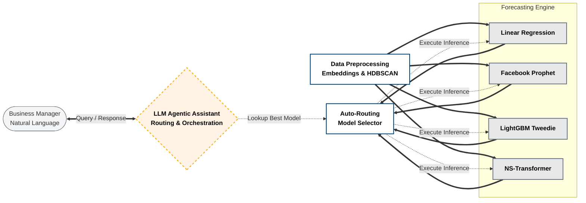
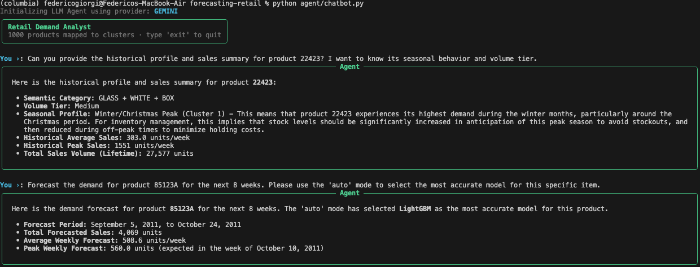

# Retail Demand Forecasting with Agentic AI


An end-to-end, production-ready Machine Learning pipeline for SKU-level retail demand forecasting on the UCI *Online Retail II* dataset (UK gift-ware retailer).

This project bridges the gap between complex data science operations and business decision-making by implementing a scalable MLOps architecture, four distinct forecasting models (including a State-of-the-Art Non-Stationary Transformer and Optuna auto-tuning), and an **LLM-based Agentic Assistant** for natural language querying and automated model routing.

---

## 📖 Table of Contents
- [System Architecture](#-system-architecture)
- [Key Features](#-key-features)
- [Repository Structure](#-repository-structure)
- [Getting Started](#-getting-started)
- [Usage & Pipeline Execution](#-usage--pipeline-execution)
- [The Agentic AI Layer](#-the-agentic-ai-layer)
- [Modeling Strategy](#-modeling-strategy)

---

## 🏛 System Architecture

The conceptual architecture of the system follows a strict separation of concerns, progressing from raw data ingestion to dynamic model routing, orchestrated by an intelligent AI layer.



### Architecture Breakdown
1. **Data Preprocessing & Clustering:** Centralized ingestion that cleans data, engineers temporal/pricing features, calculates Syntetos-Boylan demand classes (Smooth, Erratic, Lumpy, Intermittent), and clusters SKUs using HDBSCAN on Gemini LLM embeddings of product descriptions.
2. **Forecasting Engine:** Four parallel modeling architectures that train dynamically based on the semantic/behavioral clusters. Includes automated hyperparameter tuning via Optuna.
3. **Auto-Routing Model Selection:** Evaluates the test-set WMAPE for every SKU across all models and builds a routing matrix (`best_model_per_sku.json`).
4. **Agentic Orchestration:** An LLM-powered layer that abstracts backend complexity. It interprets business queries, automatically routes inference to the best-performing model for that specific product, and provides analytical insights.

---

## ✨ Key Features

* **Intelligent Auto-Routing:** The Agentic Chatbot automatically serves predictions from the most accurate model for any given SKU, removing the guesswork from model selection.
* **Semantic & Behavioral Clustering:** Models are trained on aggregated clusters built using Gemini text embeddings and time-series profiles, drastically improving robustness and capturing cross-learning effects between similar products.
* **Advanced Feature Engineering:** Integrates Syntetos-Boylan demand profiling (ADI/CV2), pricing dynamics, return rates, Autoregressive Lags, and UK Holiday constraints.
* **State-of-the-Art Deep Learning:** Implements the Non-Stationary Transformer (NeurIPS 2022) with De-stationary Attention mechanisms (`tau` and `delta` learners) using PyTorch.
* **Automated Tuning:** Seamless integration with Optuna for 50-trial hyperparameter sweeps on LightGBM, Prophet, and Ridge Regression.

---

## 📂 Repository Structure

To ensure scalability and maintainability, the repository follows modern MLOps best practices:

```text
forecasting-retail/
│
├── agent/                      # Production inference layer
│   ├── artifacts/              # Serialized models, JSON lookups, and best params
│   ├── inference/predict.py    # Robust inference engine with model routing
│   └── chatbot.py              # LLM conversational interface (CLI)
│
├── data/                       # Raw and processed datasets (ignored in git)
│
├── notebooks/                  # Interactive playgrounds for EDA and Sandboxing
│
├── src/                        # Core mathematical and utility logic (The Engine)
│   ├── models/                 # Unified API for LR, Prophet, LightGBM, NST, and Selector
│   └── tools/                  # Data loaders, embeddings, clustering, evaluation
│
├── requirements.txt            # Project dependencies
└── README.md                   
```

---

## 🚀 Getting Started

### 1. Prerequisites
- Python 3.10+ (Tested on 3.12 / 3.13)
- Git

### 2. Installation
Clone the repository and install the dependencies:

```bash
git clone https://github.com/yourusername/forecasting-retail.git
cd forecasting-retail

# Create a virtual environment (recommended)
python -m venv venv
source venv/bin/activate  # On Windows: venv\Scripts\activate

# Install dependencies
pip install -r requirements.txt
```

### 3. Environment Variables
To use the Agentic Chatbot and generate embeddings, create a `.env` file in the root directory:

```env
OPENAI_API_KEY=your_openai_api_key_here
GEMINI_API_KEY=your_gemini_api_key_here
```

---

## ⚙️ Usage & Pipeline Execution

### Step 1: Data Preprocessing
Generate the ML-ready Parquet dataset. This handles data cleaning, feature engineering, LLM embeddings, and HDBSCAN clustering.

**Option A — Terminal (recommended for automation):**
```bash
python scripts/process_data.py
```

**Option B — Notebook (recommended for exploration):**
Open `notebooks/data_processing_playground.ipynb` and execute from top to bottom.

### Step 2: Train Models & Tune Hyperparameters
Each model runs an Optuna hyperparameter sweep (where applicable), trains the cluster models, and saves the per-SKU WMAPE metrics.

**Option A — Terminal:**
```bash
python src/models/lightgbm_recursive.py
python src/models/linear_regression.py
python src/models/prophet_model.py
python src/models/ns_transformer/train.py
python src/models/sarimax.py
```

**Option B — Notebooks (one per model, with plots and diagnostics):**
| Model | Notebook |
|---|---|
| LightGBM | `notebooks/lighgbm_playground.ipynb` |
| Ridge Regression | `notebooks/lr_playground.ipynb` |
| Prophet | `notebooks/prophet_playground.ipynb` |
| NS-Transformer | `notebooks/nst_playground.ipynb` |
| SARIMAX | `notebooks/sarimax.ipynb` |

### Step 3: Run the Auto-Router
Generate the optimal routing matrix by comparing the saved evaluation metrics.

```bash
python src/models/model_selector.py
```

### Step 4: Run the Agentic Assistant
Interact with the models via the natural language terminal interface.

```bash
python agent/chatbot.py
```

---

## 🤖 The Agentic AI Layer

The `chatbot.py` script acts as a smart orchestrator. It allows non-technical business managers to query complex models without writing code.

**Example Interaction:**


---

## 📈 Modeling Strategy

1. **LightGBM (Tweedie):** The primary workhorse. A gradient boosting framework using the Tweedie objective to naturally handle zero-inflated, intermittent retail demand without predicting negative values.
2. **Linear Regression (Ridge):** A highly interpretable autoregressive baseline utilizing dummy variables for temporal states.
3. **Facebook Prophet:** Specialized in capturing strong additive multi-seasonality (weekly, yearly) and holiday effects.
4. **Non-Stationary Transformer (NST):** A deep learning architecture that tackles the inherent non-stationarity of retail markets. It utilizes Projector networks (`tau` and `delta` learners) to de-stationarize the inputs before attention calculation.
5. **SARIMAX:** A pure statistical time-series model. It is used as a rigid baseline for highly stable seasonal patterns where machine learning models might overfit.
